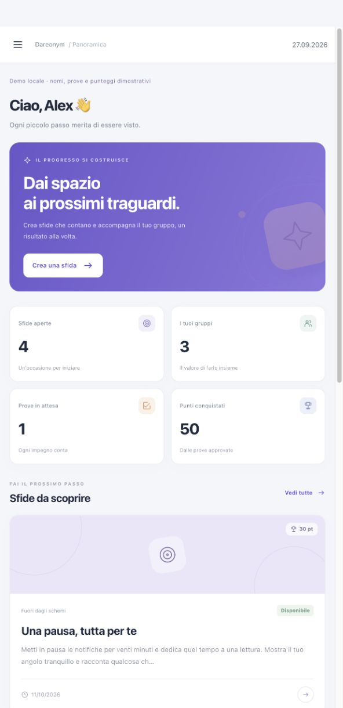

# Dareonym 2

**Piccoli passi. Risultati condivisi.**

Dareonym trasforma gli obiettivi di un gruppo in sfide concrete: il creator pubblica una sfida, il partecipante invia una prova fotografica e il creator la valuta. I risultati approvati alimentano la classifica individuale e di squadra.

Ricostruzione del progetto originale di Flavio Petrone, con codice e interfaccia nuovi. Pensata per un primo repository completo, comprensibile e utilizzabile: nessun framework da configurare sul server, nessun asset commerciale, nessuna dipendenza da CDN.

## Cosa puoi fare

| Amministratore | Creator | Partecipante |
| --- | --- | --- |
| Creare account e gruppi | Gestire i partecipanti dei propri gruppi | Vedere le sfide dei propri gruppi |
| Assegnare un creator a ogni gruppo | Pubblicare e chiudere sfide | Inviare una foto e una descrizione |
| Disattivare account e reimpostare password | Approvare prove o chiedere di riprovare | Leggere il riscontro e inviare una nuova prova |
| Supervisionare l’attività | Seguire i progressi del gruppo | Consultare storico e classifiche |

Tutti possono cambiare nome pubblico e password dal proprio profilo.

### Regole del gioco

- Ogni sfida appartiene a un gruppo e ha istruzioni, punti e una scadenza facoltativa.
- Un partecipante invia una prova per sfida. Una prova respinta può essere sostituita prima della scadenza.
- Soltanto il creator assegnato al gruppo o un amministratore può valutarla. Il rifiuto richiede un riscontro scritto.
- Una prova approvata assegna i punti una sola volta. Le classifiche sono calcolate dalle prove approvate, non da contatori modificabili dal browser.
- I punti storici restano associati al gruppo della sfida anche se cambia la sua composizione.
- Le classifiche mostrano i nomi pubblici degli account attivi. A parità di punti contano il numero di sfide approvate e poi l’ordine alfabetico del nome.
- Chiusura o scadenza bloccano nuovi invii; le prove ricevute possono ancora essere valutate.

## Interfaccia

Dashboard per ruolo, schede delle sfide, gestione dei gruppi, coda di valutazione, cronologia personale e classifiche. Layout responsive, navigazione da tastiera, moduli con etichette e stati espressi anche a parole. Colori, icone SVG e illustrazioni geometriche sono originali; font di sistema, senza servizi esterni.



## Stack

- PHP 8.2+ con PDO, GD, Fileinfo e mbstring.
- MySQL 8 / MariaDB con InnoDB per l’hosting; SQLite per una demo locale isolata.
- HTML, CSS e JavaScript senza build obbligatoria.
- Python 3 per i test end-to-end HTTP.

PHP 8.4.11 e MariaDB 13.0.2 sono stati effettivamente usati nel collaudo locale. MySQL 8 e le versioni PHP precedenti a quella di test sono obiettivi di compatibilità, non combinazioni collaudate in questa consegna. Prima del caricamento verificare la versione PHP disponibile nell’account Altervista.

## Prova locale in due passaggi

Su una copia pulita, con PHP e le estensioni indicate:

```sh
php scripts/demo.php
php -S 127.0.0.1:8000 router.php
```

Apri [localhost](http://127.0.0.1:8000). La demo genera un database SQLite, account fittizi e immagini sintetiche, tutti esclusi da Git.

| Ruolo | Email |
| --- | --- |
| Amministratore | `admin@example.test` |
| Creator | `creator@example.test` |
| Partecipante | `user@example.test` |

Password **solo per questa demo locale**: `Local-demo-2026!`.

Non caricare il database della demo, `config/local.php` o le sue immagini sul sito. La demo non modifica un progetto già configurato. Per preparare l’hosting usa una nuova estrazione dello ZIP pulito.

## Installazione online

La procedura completa è in [INSTALLAZIONE.md](docs/INSTALLAZIONE.md). In sintesi:

1. Fai un backup dei file e del database esistenti. Usa una cartella nuova, per esempio `/dareonym2/`, per il primo collaudo.
2. Verifica PHP 8.2+, estensioni, HTTPS e disponibilità del database con InnoDB.
3. Prepara un codice privato in `config/install.php`, partendo dall’esempio incluso oppure con `php scripts/prepare-install.php` **sul tuo computer**.
4. Carica i file, inclusi i `.htaccess`. Apri il sito tramite HTTPS.
5. Inserisci il codice privato, i parametri del database e i dati del nuovo amministratore.
6. La procedura crea le tabelle `d2_*` e `config/local.php`, elimina il codice monouso e ti porta al login.

Non importare preventivamente uno schema SQL: l’installatore crea tutto. Non vengono creati account con password predefinite. Le tabelle del vecchio progetto non vengono eliminate; se esistono già tabelle `d2_*`, l’installazione si ferma anziché sovrascriverle.

I parametri risiedono nel file PHP privato `config/local.php`. Sono supportate anche le variabili d’ambiente elencate in `.env.example`, con precedenza sul file. Il file `.env.example` è una descrizione delle variabili: **non viene caricato automaticamente come file `.env`**.

## Organizzazione del codice

```text
app/
  core.php       configurazione, PDO, sessioni, permessi, upload
  actions.php    comandi applicativi e cambi di stato
  views.php      schermate e componenti HTML condivisi
  schema.php     definizione dello schema iniziale
  setup.php      procedura web per la prima installazione
assets/          CSS, JavaScript, favicon originale
config/          esempi pubblicabili e configurazione privata locale
database/        schema SQL di riferimento (l’installer crea le tabelle)
storage/         immagini e log, mai pubblici
scripts/         strumenti CLI per demo e preparazione locale
tests/           test HTTP su copie isolate
index.php        ingresso dell’applicazione
image.php        consegna delle immagini con controllo dei permessi
router.php       router esclusivamente per lo sviluppo locale
```

Le query sono parametrizzate. I permessi sono verificati sul server anche per le richieste costruite manualmente. I cambi di stato delle prove sono condizionali e transazionali per impedire approvazioni duplicate.

## Test

```sh
python3 tests/run.py
```

Crea una copia temporanea e collauda il percorso completo con SQLite. Non usa i dati della cartella di lavoro.

Per MariaDB/MySQL, prepara **un database di prova vuoto** il cui nome cominci con `dareonym_test_`, e un JSON privato con `driver`, `host`, `port`, `database`, `username`, `password`:

```sh
python3 tests/run.py --mysql-config /percorso/privato/test-db.json
python3 tests/installer.py /percorso/privato/altro-db-vuoto.json
```

I due comandi richiedono database distinti e vuoti. Creano dati fittizi e non eliminano automaticamente le tabelle. I JSON delle credenziali devono restare fuori dal repository. Vedi [TEST.md](docs/TEST.md) per risultati e limiti.

## Sicurezza e gestione dei dati

- Hash delle password; CSRF su tutte le azioni POST, logout compreso.
- Cookie di sessione HttpOnly/SameSite, Secure sotto HTTPS; nuova sessione al login.
- Reset password e disattivazione revocano le sessioni esistenti.
- Blocco persistente dopo 10 tentativi errati, per account e indirizzo IP, in una finestra di 15 minuti.
- Foto JPG/PNG fino a 3 MB e 12 megapixel, decodificate e ricodificate in JPEG per eliminare metadati e contenuti aggiunti. Massimo 100 prove conservate per partecipante.
- File privati serviti soltanto dopo autorizzazione; nessun indirizzo email nelle classifiche.
- Protezioni CSP, intestazioni di sicurezza, messaggi pubblici senza dettagli del database.
- Registro degli eventi amministrativi nel database; log tecnici privati con riferimenti agli errori.

Per segnalazioni e limiti operativi leggi [SECURITY.md](SECURITY.md).

## Ambito della versione 2.0

Questa è una prima versione funzionante del percorso principale. Non include registrazione pubblica, recupero password via email, notifiche email/push, modifica retroattiva dei punteggi, esportazioni, cronologia di tutte le fotografie sostituite, paginazione avanzata o amministrazione della conservazione dei dati. Gli account si recuperano tramite un amministratore; le sfide pubblicate si possono chiudere e sostituire, senza modificarne retroattivamente le condizioni.

La pubblicazione del codice su GitHub e l’attivazione del servizio online sono passaggi distinti. Il collaudo sullo specifico account Altervista resta da effettuare prima di sostituire il sito attuale. La nuova versione non corregge la cronologia GitHub del progetto precedente e non revoca le credenziali esposte in passato.

## Licenza

Il codice e gli asset nuovi di questa cartella sono distribuiti con [licenza MIT](LICENSE). Il template SB Admin Pro, i file e i dati del vecchio progetto non sono inclusi. Conserva le credenziali e i dati reali fuori dal repository.
